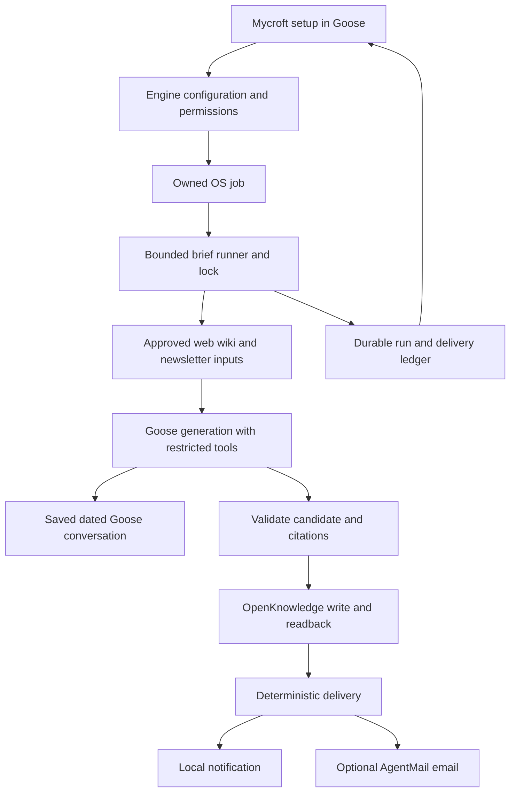
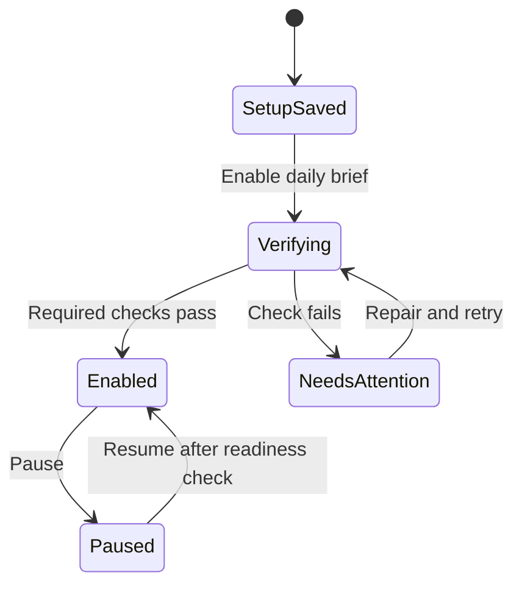
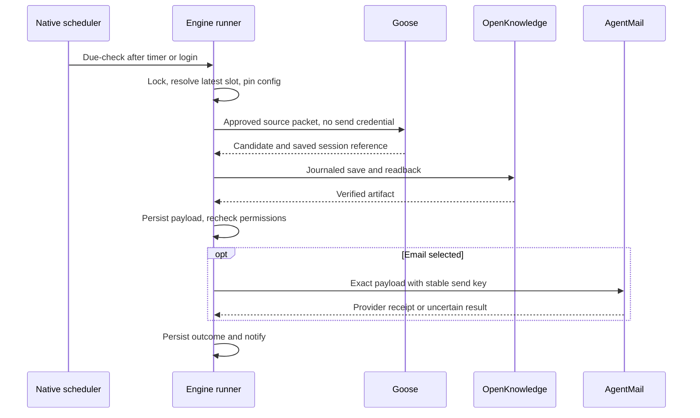

# Reliable Morning Brief - Plan

**Target repositories:** `buriedsignals/mycroft` and `buriedsignals/engine`. Paths below are relative to the named repository. This document lives in Mycroft; Engine's documentation remains canonical for runtime contracts.

## Goal Capsule

- **Objective:** A journalist completes setup once and subsequently receives a useful, cited morning brief without remembering to open Goose or run a prompt.
- **Means:** A local OS job invokes a bounded Engine runner; every brief has a wiki copy and a saved Goose conversation, with optional AgentMail delivery (KTD1–KTD4).
- **Authority:** User requirements and the local-execution decision govern. Product requirements below govern implementation decisions. Existing credential, artifact ownership, and knowledge-workspace contracts remain binding except for the explicitly proposed scheduling exception.
- **Execution:** Implement in dependency order, proving background execution and Goose session visibility before building the onboarding promise. This plan authorizes planning only; no subscriptions, emails, scheduled tasks, or production releases have been performed.
- **Stop conditions:** Stop a platform's activation if its background credential/runtime/session proof fails. Never substitute plaintext keys, direct writes to Goose's database, or a hosted copy of reporting material.
- **Completion ownership:** Implementation owns code, native acceptance evidence, migration and documentation. Production publication remains a separate release action under Engine's release rules.

---

## Product Contract

### Summary

Mycroft asks what to cover, when to run, and where the journalist wants to receive the brief. Setup produces a real first result and verifies background execution before enabling recurrence. AgentMail supplies an optional dedicated newsletter inbox and email delivery; everyone can read the brief in Goose and the wiki.

### Problem Frame

The current setup saves editorial preferences but explicitly avoids scheduling. Engine defaults schedules off and hides the toggle in Indicator Labs. The brief reads optional AgentMail input but does not send email. The existing recipe delegates saving to model instructions, and a successful headless process only establishes an exit code. These gaps allow setup to appear successful without a brief reaching the journalist.

Evidence: Mycroft `recipes/morning-brief-preflight.yaml`, `recipes/morning-brief.yaml`; Engine `bsig/internal/configure/resolver.go`, `desktop/src/renderer-journalist.ts`, `bsig/cmd/bsig/run_verb.go`.

### Key Decisions

- **Local execution with catch-up** (session-settled: user-directed — chosen over always-on hosting: run on the journalist's computer, including with Goose closed, and catch up after sleep). Governs R4, R5.
- **AgentMail first.** It supplies a dedicated inbox plus sending without requiring the journalist to operate a custom sending domain. Resend remains an alternative, not a second integration in this change. Governs R2, R8, R10.
- **A saved conversation is the chat destination.** Do not inject unsolicited messages into whichever Goose chat happens to be open. Governs R7.
- **Setup and controls stay in Mycroft in Goose** (session-settled: user-directed). No Morning brief section or management screen is added to Indicator Labs. Existing private credential capture remains available. Governs R1–R3, R6.

### Requirements

**Setup and control**

- R1. Setup collects the beat, watchlist, chosen sources, exclusions, reporting window, days, local start time and IANA timezone. Show the timezone and expected next run explicitly; the selected time is when generation starts, not a guaranteed inbox-arrival minute.
- R2. Ask “Where should your brief arrive?” with Goose and email choices. Email asks for the exact recipient and a dedicated AgentMail sending inbox. Offer connect-existing and create-account handoffs, explain how to obtain the required credential, and return through Engine's private key capture to the saved setup. Explain the selected or newly created inbox; allow switching to Goose-only without restarting. Newsletter collection, email delivery, and newsletter subscriptions are independent opt-ins.
- R3. One explicit “Enable daily brief” action authorizes setup verification and the displayed recurring work. Keep the schedule paused until a first brief, actual OS-background readiness, and the chosen delivery path succeed. Keys use the existing private Engine capture flow, never Goose chat. Persist verification-in-progress and awaiting-email-confirmation states, show the current step and paused recurrence, and resume them after setup closes. Offer receipt-confirmed, email-not-received and edit-destination actions; retry and destination changes follow R14–R15. Failed verification preserves the configuration with a repair action.
- R4. Once enabled, run without Goose or Indicator Labs open, as the logged-in user on macOS, Windows and supported Linux desktops. Explain that an awake computer, usable credentials and required source/model services are necessary. No promise applies while switched off or logged out.
- R5. After sleep or login, catch up only the latest missed eligible slot, not a backlog of daily emails. Keep a single run identity per brief profile and reporting date, including across daylight-saving changes, concurrent manual runs and clock changes.
- R6. Through Mycroft in Goose, the journalist can inspect status, change settings, run now, pause/resume, remove the schedule, retry delivery and open a result. Return next run, last successful brief, partial inputs, failure reason and recovery action from durable Engine state. “Where is today's brief?” returns the saved conversation link and wiki location, or explains why no result is available yet.

**Output and delivery**

- R7. Save each completed brief through OpenKnowledge and verify its contents. Preserve the full brief in a named Goose conversation and record its session ID. A local notification opens that conversation; if notifications are denied, the conversation and wiki remain accessible through Goose and the status prompt in R6. Do not claim chat delivery based solely on a wiki write.
- R8. Email sending happens in deterministic code after a verified save, to the configured recipient only. Persist the exact rendered payload and provider receipt so retries do not regenerate or alter a send. Distinguish provider acceptance from confirmed delivery and from an uncertain result.
- R9. Include sources, why each item matters, useful story angles and a sources-checked summary. Explicitly label unavailable sources and the actual reporting window. An empty news day can produce a short honest brief; complete acquisition failure must produce a failure status instead of a fabricated digest.

**Newsletters and privacy**

- R10. Offer a beat-specific shortlist of newsletters, then subscribe only to the user's selected publications. Show the actual inbox address for forwarding or manual subscriptions. Track submitted, confirmation pending, active, human action required and failed states separately.
- R11. Read incoming messages using a durable time/message cursor and pagination, not unread status. Do not mark read, delete mail, reply, or follow arbitrary links during generation. Exclude sent briefs from newsletter inputs.
- R12. Pin source scope and outgoing-content scope during setup. Email is a cloud disclosure even when the model runs locally. Track collection and disclosure permissions separately for every source type. Default outbound content to approved public sources; private wiki material and AgentMail message bodies require explicit disclosure approval before entering an emailed brief. Approve newsletters individually; forwarding arbitrary mail into the inbox never grants disclosure permission. Enforce this through input separation, not a prompt asking the model to redact secrets afterward.
- R13. Newsletter/web content and model output cannot change schedule, recipients, permissions or subscriptions. Generation receives no AgentMail send credential or general send tool. Subscription confirmations are scoped to the publication the user selected; payment, CAPTCHA, login and terms requiring a human remain visible handoffs.

**Reliability and lifecycle**

- R14. Persist generation, wiki save, session creation, notification and email outcomes separately. Retry transient failures with limits; recover saved results without generating a different brief. Permanent credential/configuration failures become “needs attention,” with no interactive background prompt or indefinite hang. On exhausted retries or needs-attention, issue a local failure notification naming the missed date and recovery action. Deduplicate notices for the same unresolved cause and retain failure status for Mycroft's status response if notifications are denied; no alert is promised while the computer is off.
- R15. Pause prevents future runs and new sends, including delivery retries. Recheck current permissions immediately before sending. Changing recipient or disclosure scope invalidates pending old-route delivery and requires verification before activation. Removing a schedule preserves briefs and the AgentMail inbox; unsubscribing and deleting mail accounts are separate actions.
- R16. Upgrade and uninstall own only registered Mycroft jobs. Migrate the owned legacy morning-brief schedule transactionally and prevent dual scheduling. Existing profiles convey editorial preferences, never implied permission to email or subscribe.

### Acceptance Examples

- AE1. Complete setup without AgentMail, close Goose and Labs, and let the native job run. A saved wiki brief and Goose conversation exist; opening the notification resumes that exact conversation.
- AE2. Choose email and a recipient. Verification sends the preview only after the Enable action; future runs send the same saved digest to that destination and record provider acceptance. No new approval is required for each ordinary run within that scope.
- AE3. Sleep through three scheduled slots. Wake produces one latest-slot brief, with its actual coverage window visible; no burst of stale emails follows.
- AE4. Interrupt after AgentMail accepts a message but before the local receipt is saved. Recovery reuses the same idempotency key and payload within the provider window; outside that window it reconciles or marks delivery uncertain, never blindly sends again.
- AE5. A newsletter instructs the assistant to email private notes elsewhere. Neither recipient nor source scope changes; the email credential is unavailable to generation.
- AE6. Pause while a brief is being generated. Generation may retain its local result, but a send that has not begun is suppressed. If already submitted, show that fact rather than claiming recall.
- AE7. With both apps closed, a scheduled run cannot acquire sources or use its credentials. After bounded recovery, a single local failure notice explains the repair action; if notifications are denied, asking Mycroft for brief status returns the failure and recovery guidance.
- AE8. A journalist without AgentMail completes the account/key handoff, leaves setup during verification and returns after the preview is sent. Setup shows awaiting receipt and paused recurrence, then enables after confirmation; switching to Goose-only preserves the beat and sources.

### Scope Boundaries

This change covers one morning-brief profile per Mycroft installation, local execution, a single recipient, AgentMail, assisted newsletter setup through Goose, and existing supported desktop platforms. These are planning defaults, not prior user commitments. Setup and management use Mycroft in Goose and typed Engine operations; a new Indicator Labs section, navigation item or management screen is explicitly out of scope.

Deferred: Resend as an additional provider, hosted execution, multi-recipient distribution, multiple brief profiles, arbitrary current-chat injection, automatic paid subscriptions, and full bidirectional email-assistant behavior. A failed notification cannot silently become email delivery.

---

## Planning Contract

### Key Technical Decisions

- KTD1. **OS-triggered short-lived Engine process.** Use per-user launchd on macOS, Task Scheduler on Windows, and user systemd timers on supported Linux desktops. A cheap periodic due-check plus login/startup activation reads one shared schedule policy; no permanently resident Mycroft service. Revise Engine `docs/engine/spec.md`'s explicit prohibition on owned LaunchAgents/timers narrowly for this purpose. This implements R4–R5 without requiring Goose Desktop to own liveness.
- KTD2. **One versioned configuration and run ledger.** Engine owns validated configuration and local state; the wiki monitoring profile is a human-readable projection. Atomic writes and a process-safe lock guard run identity, configuration generation, slot coverage, source cursor, content hash, session ID and delivery receipts. Do not reuse the current loose Markdown profile as a scheduler database.
- KTD3. **Reuse Engine's verified runtime and knowledge operations.** Build on `internal/run` for pinned Goose/provider execution and owned local-model lifecycle, and `knowledge.OpenKnowledge.BatchCommit` for journaled, reconciled writes. Add a bounded briefing execution policy instead of weakening generic credential requirements. Optional source failures must not inherit the generic wrapper's all-keys-required behavior.
- KTD4. **Goose session as a supported result, not a database mutation.** Goose 1.50.0 documents persisted CLI sessions, shared Desktop history, and `goose://resume/<session-id>`. Capture its supported session metadata, use the same user storage/profile, and require a full readable final brief. A disposable-profile proof is the first execution gate; direct database writes are forbidden. [Run documentation](https://github.com/aaif-goose/goose/blob/v1.50.0/documentation/docs/guides/running-tasks.md), [session documentation](https://github.com/aaif-goose/goose/blob/v1.50.0/documentation/docs/guides/sessions/session-management.md), [resume handler](https://github.com/aaif-goose/goose/blob/v1.50.0/ui/desktop/src/main.ts#L600).
- KTD5. **Separate collection, synthesis and external effects.** The trusted collector fetches selected inputs and assigns stable source IDs. A dedicated generation tool profile exposes only bounded read/search access and candidate output; it cannot invoke general shell tools or access mail credentials. The runner validates source references, saves the artifact, then sends through a constrained adapter. API keys remain in the credential broker; a readonly AgentMail collector and deterministic sender use them outside the model process. Structural validation establishes source traceability, not the truth of every generated sentence.
- KTD6. **AgentMail REST adapter with explicit inbox identity.** Correct the legacy `/v1/inboxes/default` assumption to the documented `/v0/inboxes/{inbox_id}/messages` contract. Poll with pagination and a saved cursor; use `client_id` for idempotent inbox creation and `Idempotency-Key` for sends. AgentMail's send keys expire after 24 hours, so local receipts must outlive that window. [Inbox creation](https://docs.agentmail.to/knowledge-base/creating-first-inbox), [message listing](https://docs.agentmail.to/api-reference/inboxes/messages/list), [sending](https://docs.agentmail.to/messages), [idempotency](https://docs.agentmail.to/idempotency).
- KTD7. **AgentMail before Resend.** AgentMail fits the incoming-newsletter and outgoing-brief workflow already exposed by Mycroft. Resend also supports receiving, so it is not categorically incapable; its custom-domain setup and another adapter add work without improving this first delivery path. [Resend domains](https://resend.com/docs/add-a-domain), [receiving](https://resend.com/docs/agent-email-inbox-skill).
- KTD8. **Explicit publication workflow.** Generate a suggested newsletter shortlist using current search; the journalist selects it. Subscribe via supported publication forms/browser handoffs, preserving per-publication status and proof. The same API key does not authorize unlimited external subscriptions. Confirmation automation uses an HTTPS-only fetcher bound to the selected publication's authorized hosts. Validate resolved public destination addresses at connection time and every redirect; reject URL credentials, loopback, private and link-local destinations. Do not inherit browser cookies or unrelated authorization headers. Hand off manually when these conditions cannot be met.

### High-Level Technical Design

The diagram shows schedule state. Each run separately records generation, save and delivery outcomes. Pausing applies during every run stage: it suppresses all sends not yet submitted, including retries, while preserving local results. A failed run does not erase the schedule's state or its history.

### Scheduling and Recovery Policy

The first version uses a five-minute lightweight due-check while logged in, plus a check at login/startup. The runner computes eligibility in the saved IANA timezone rather than relying on three OS implementations to agree about DST. Use native missed-start behavior where available, but the durable latest-slot calculation remains authoritative. A nonexistent local time runs at the next valid time; a repeated time runs once. Schedule edits do not retroactively create a second delivered brief for the same reporting date.

Apple documents calendar-trigger catch-up after sleep, but not after power-off; this is why login reconciliation is necessary. [Apple scheduling documentation](https://developer.apple.com/library/archive/documentation/MacOSX/Conceptual/BPSystemStartup/Chapters/ScheduledJobs.html). Windows and Linux trigger details require native compatibility evidence in U3. No wake-from-sleep, stored login password, system/root task, or Linux lingering is enabled by default.

Generation has a finite configurable deadline, initially 20 minutes including provider startup, and no overlapping model job. Retry transient work at most three times within the same eligible day with backoff; a dependency requiring human action does not repeatedly prompt. Delivery retries reuse the saved result. A completed slot cannot become due again because its email failed.

The input cursor advances only after the source packet and brief are durably saved. Catch-up coverage starts from the last successful collection, capped at seven days with any omitted interval disclosed. User-configured shorter windows remain authoritative. A multi-day outage produces one recent brief, not reconstructed historical briefs.

### Assumptions and Compatibility Gates

The first release supports the current logged-in user's desktop environment; locked credentials can delay a run until unlock. Native notifications are best effort and may be denied by OS settings. Email setup includes a user-confirmed test receipt; routine runs show provider acceptance unless a supported provider event establishes delivery.

U1 must prove that restricted generation, readable persisted Goose sessions, OpenKnowledge without its GUI, provider credentials and local inference all work from the real background context. Exact upstream session-result fields and native notification adapters are implementation-time compatibility details. If a platform fails, do not enable it or advertise it as working; report the concrete missing capability before changing the product promise.

---

## Implementation Units

### U1. Prove unattended runtime and saved conversation

**Goal:** Establish the feasibility of the required local result before building the setup conversation. **Requirements:** R4, R7, R13–R14. **Dependencies:** none.

**Files:** Engine `bsig/internal/run/run.go`, `bsig/internal/run/run_test.go`, `bsig/internal/knowledge/mcpstdio_test.go`; new `bsig/internal/brief/runtime.go`, `runtime_test.go`; platform acceptance fixtures under `desktop/scripts/`.

**Approach:** Reuse verified runtime receipts and selected-provider startup. Add the job-specific credential/tool policy and typed session/result capture. Prove KTD3–KTD5 with the pinned Goose release before depending on the setup conversation. Keep mail credentials outside the child environment. This is a behavior-bearing integration, not a successful-process-exit check.

**Test scenarios:** Goose/Labs/knowledge GUI closed; cloud and local provider; locked credential store; missing optional source credential; simultaneous interactive local-model use; full final brief visible after Desktop restart; resume link while an unrelated chat is open; denied inherited shell/send tools.

**Verification:** AE1's runtime and session portion is demonstrated on each supported native platform. Record any platform capability gap as a release blocker.

### U2. Add one authoritative brief configuration and run controller

**Goal:** Make setup, status and recovery deterministic. **Requirements:** R1–R3, R5–R6, R14–R15. **Dependencies:** U1.

**Files:** Engine new `bsig/cmd/bsig/brief_verb.go`, `brief_verb_test.go`, `bsig/internal/brief/config.go`, `state.go`, `runner.go` and corresponding tests; extend `bsig/cmd/bsig/main.go` and relevant CLI contract tests.

**Approach:** Expose typed configuration, verification, activation, pause/resume, status, run-now, history, delivery-retry and open-result operations through the existing Engine plan/apply and JSON conventions. Persist configuration generations, slot identities and separate result states. A Goose-requested run-now queues/launches one bounded job; it must not recursively invoke the Mycroft setup recipe.

**Test scenarios:** Concurrent timer/manual requests yield one run; setup cancellation leaves paused state; invalid timezone/recipient rejected; crash and stale-lock recovery; DST repeated/missing time; recipient edit during generation prevents old-route sending; pause suppresses pending retry; a fresh Goose chat reads the same durable state as the Engine CLI.

**Verification:** R6 actions return the underlying Engine result through Goose and cannot report success from narrative output alone.

### U3. Register and own native background jobs

**Goal:** Make recurrence independent of Goose Desktop. **Requirements:** R3–R5, R15–R16. **Dependencies:** U1–U2.

**Files:** Engine new `bsig/internal/scheduler/{darwin,windows,linux}.go` and tests; `bsig/internal/plan/step_register_background_job.go` and test; extend `plan/model.go`, `plan/executor.go`, `plan/step_remove_artifact.go`, `execpolicy/policy.go`, `products/mycroft/module.go`, `module_test.go`, runtime verification/doctor and `docs/engine/spec.md`.

**Approach:** Introduce an owned typed job artifact with sealed configuration, exact executable identity, explicit working directory and no secrets in job arguments. Register the OS-specific triggers from KTD1. Preserve the no-resident-daemon contract. Ensure the executable reference survives app updates, including Windows Squirrel's versioned paths. Activation must exercise the actual job, not an interactive-shell substitute.

**Test scenarios:** AE3; wake/login/offline recovery; user logged out; locked keychain; Linux without supported systemd session; failed registration rollback; changed owned job; upgrade changes runtime path; disable/uninstall removes only the owned brief job and retains data.

**Verification:** A brief runs with both apps closed, catch-up is bounded, and native scheduler state matches Engine status on macOS, Windows and Linux.

### U4. Collect sources and produce a verifiable brief

**Goal:** Turn configured sources into a saved, readable result. **Requirements:** R7, R9, R11–R14. **Dependencies:** U1–U2.

**Files:** Engine new `bsig/internal/brief/sources.go`, `artifact.go` and tests; reuse `bsig/internal/knowledge/openknowledge.go`, extend its tests. Mycroft `recipes/morning-brief.yaml`, relevant `tools/` search/scrape adapters, and new `tools/tests/test_morning_brief_contract.py`.

**Approach:** Implement KTD5 with stable source IDs and deterministic coverage records. Support explicit websites/RSS, selected wiki material and optional AgentMail inputs; record unsupported sources instead of implying monitoring. Produce a candidate bundle plus the complete final Markdown in the saved Goose session. Validate citation IDs, required sections and limits, then use the resolved OpenKnowledge route and readback. Never double-prefix the Mycroft namespace or fall back to direct wiki filesystem writes.

**Test scenarios:** Empty news day versus total acquisition failure; partial source failure; pagination and already-read newsletters; echoed outgoing brief excluded; bad citation ID; unapproved private wiki material and forwarded email excluded from email-mode generation; explicitly approved private sources included only within their disclosure scope; crash after wiki save; modified existing wiki note causes a visible conflict instead of overwrite.

**Verification:** The final session, saved wiki and payload refer to the same content hash; sources and omissions are inspectable. Human evaluation checks relevance and claim support on representative beats.

### U5. Add AgentMail delivery and local result notifications

**Goal:** Make a saved result reach the selected destination. **Requirements:** R2, R7–R8, R12–R15. **Dependencies:** U2, U4.

**Files:** Engine new `bsig/internal/brief/agentmail.go`, `delivery.go`, `notification.go` and tests; `bsig/internal/keys/registry.go` and validation tests; platform notification integration in `desktop/src/main/` with native acceptance fixtures.

**Approach:** Resolve or create one dedicated inbox, persist its identity, and verify sending using KTD6. Keep the destination and safe text/HTML renderer outside generation. Store the exact outgoing payload before sending. Add a supported OS notification action that can open Goose while Labs is closed; do not depend on a running Electron renderer. Preserve result links and notification outcomes for Mycroft's status response.

**Test scenarios:** AE2, AE4–AE7; revoked key; 429/backoff; accepted versus delivered status; same key/different payload conflict; uncertain retry beyond 24 hours; notification denied; notification click after restart; private source body never enters the default public-only email source packet without separate disclosure approval.

**Verification:** A real test email reaches the user-confirmed address, duplicate retry does not create another message, and no-email mode needs no AgentMail credential. Save success survives delivery failure.

### U6. Build setup conversation and newsletter onboarding

**Goal:** Let a journalist configure and verify the workflow without terminal knowledge. **Requirements:** R1–R3, R6, R10, R12–R13, R15. **Dependencies:** U2–U5.

**Files:** Mycroft `recipes/start.yaml`, `recipes/morning-brief-preflight.yaml`, `skills/bsig-engine/SKILL.md`, new `recipes/newsletter-setup.yaml`, related recipe/behavior tests. Engine `products/mycroft/getting_started.go` and its tests; reuse the existing private credential capture flow.

**Approach:** The Mycroft setup conversation invokes typed Engine operations. Present a summary of beat, selected sources, start time/timezone, destination, disclosure scope and sleep behavior that the journalist can revise in chat. Provide the AgentMail account connection and resumable verification flows in R2–R3. The journalist's explicit confirmation starts the verification transaction; email asks for a receipt confirmation before activating recurring delivery. Newsletter setup follows KTD8 and can continue while a functioning brief is already active. Expose “Where is today's brief?” and “Pause my brief” through the Mycroft Engine skill, including direct result links and guidance when notifications are denied.

**Test scenarios:** AE8; setup initiated and resumed through Goose with protected key-entry handoffs; no email; incoming newsletters with Goose-only delivery; inbox creation failure; changed recipient invalidates verification; manual newsletter confirmation; malicious confirmation URL, redirect and DNS-resolution fixtures; failed CAPTCHA/payment handoff; cancellation; source text cannot alter control fields; notification denial is clearly explained without losing access to the result.

**Verification:** A new user finishes with an actual first result and truthful next-run/channel status. Recipe evaluation proves actions, not merely reassuring setup prose.

### U7. Migrate existing installations and correct product guidance

**Goal:** Ship one scheduling authority without breaking existing data. **Requirements:** R15–R16 and AE1–AE8. **Dependencies:** U3–U6.

**Files:** Engine `products/mycroft/content.go`, `module.go`, `module_test.go`, install contract schemas/templates and catalog copies; `bsig/internal/plan/step_remove_artifact.go` and rollback tests; `docs/engine/spec.md`, `docs/engine/goose-secrets.md`, desktop onboarding docs. Mycroft `install/contracts/`, `docs/schedules.md`, `docs/first-run.md`, `docs/troubleshooting.md`, `README.md`, `index.html` and contract tests.

**Approach:** Import old beat/source preferences as an inactive draft. Detect the exact owned Goose morning-brief schedule, preserve its restoration data, verify the new path, quiesce the old path and activate the new one transactionally. Do not migrate the separate wiki-audit schedule or delete the obsolete updater job opportunistically. Update misleading email/automatic-schedule copy only once native acceptance passes.

**Test scenarios:** Legacy enabled/disabled schedule; hand-edited or foreign schedule; failure midway through handover; rollback leaves one active authority; updates preserve preferences and run receipts; uninstall preserves wiki and inbox; current install schema and generated configuration remain consistent.

**Verification:** Native end-to-end matrix passes, the old restoration instructions cannot recreate dual scheduling, and documentation matches actual setup and runtime behavior.

---

## Verification Contract

Implementation begins with U1's real pinned-runtime proof, then uses focused tests for changed Engine packages and Mycroft recipe contracts. Broader required gates include Engine Go vet/race tests and desktop tests/type checks under the respective AGENTS instructions. No production build/release workflow is used as an iterative test harness.

Native acceptance must cover all three supported desktop platforms with Goose and Labs closed, selected local/cloud providers, actual OS job invocation, unavailable credentials, sleep/login catch-up, delivery failure, native notification permissions and app upgrade. Disposable knowledge workspaces and explicitly authorized test recipients are required; never subscribe real users or email real reporting data for fixtures.

Review source isolation with malicious newsletter content, verify that provider credentials and mail keys never enter model-visible tools/logs/job definitions, and inspect the full diff for stale code or duplicate scheduler ownership. A unit test or successful process exit cannot replace evidence that the saved conversation opens and the selected delivery path works.

### Planning Review Record

Reviewed for coherence, feasibility, scope, product behavior, design, security and adversarial gaps. Incorporated separate disclosure permissions for inbox content, constrained confirmation fetching, pause-state consistency, proactive failure notices, AgentMail account setup, resumable verification and result access through Goose. No unresolved review finding blocks starting U1; native compatibility remains unproved until its implementation checks run.

The optional external-model review did not run: automatic approval review rejected disclosure of internal repository and security details to Anthropic. In-process reviews supplied the coverage above. Planning verification was document inspection and whitespace checking only; no runtime test, email, subscription or scheduled job was executed.

## Definition of Done

- A new user can configure a beat and destination, complete verification, and receive a later brief without Goose or Labs open.
- AE1–AE8 pass, and each feature-bearing unit's native/integration checks have evidence.
- Schedule, generation, save and delivery states remain accurate under interruption, sleep and retries.
- Supported platforms enforce the same controls; unsupported background capability is exposed rather than silently enabled.
- Source privacy, recipient authorization, credentials and subscription boundaries are enforced outside the model.
- Migration, rollback, update, pause and uninstall leave one scheduler authority and preserve reporting data.
- Documentation and onboarding explain where the result appears and what sleep/offline behavior means.
- Abandoned experimental code is removed; no unrelated changes or production publishing are bundled into implementation.
